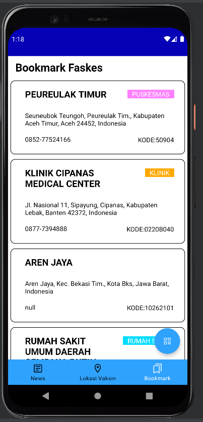

# Deskripsi Aplikasi
Aplikasi Perlu Dilindungi adalah suatu aplikasi mobile berbasis Android. Pada aplikasi ini, pengguna dapat melihat daftar berita terkait pandemi COVID-19 serta membukanya, mencari faskes berdasarkan provinsi, kota, dan lokasi pengguna, melihat detail dari faskes tersebut, menyimpan bookmark dari faskes tersebut, melakukan scan QR code untuk check in, beserta deteksi temperatur suhu sekitar. Untuk melakukan navigasi antar halaman-halaman yang ada di aplikasi ini, terdapat suatu navigation bar di bagian bawah aplikasi. Aplikasi juga memiliki layout responsive yang dapat berubah sesuai mode potrait atau landscape dari perangkat.
# Cara Kerja
### Menampilkan Berita COVID-19
Aplikasi akan menampilkan daftar berita yang didapat dari API pada suatu RecyclerView. Untuk mendapatkan berita ini, dilakukan Get Request ke API dan data yang didapat pun diterjemahkan melalui adapter agar dapat diproses RecyclerView. Untuk tiap item di RecyclerView, ditampilkan headline, tanggal, dan thumbnail dari berita. Thumbnail ini dapat dari URL gambar yang ada di data. Ketika item di klik, maka akan dibuka suatu webview di dalam aplikasi yang menampilkan konten dari berita tersebut. Ini dicapai dengan membuka URL yang ada di data berita melalui webview.
### Menampilkan Daftar Faskes untuk Vaksinasi
Aplikasi akan menampilkan dua buah spinner agar pengguna dapat memilih provinsi dan kota dari faskes yang ingin dicari. Data untuk item dari spinner tersebut didapat dengan melakukan Get Request pada API. Ketika pengguna baru masuk ke halaman, langsung dilakukan Get Request untuk data provinsi dan ketika provinsi terpilih, dilakukan Get Request untuk data kota untuk provinsi terpilih. Ketika pengguna menekan tombol search, akan dilakukan Get Request ke API dengan parameter pilihan provinsi dan kota dari pengguna. Lalu, data faskes ini akan di-sort berdasarkan kedekatan koordinatnya dengan lokasi pengguna. Lokasi pengguna ini didapatkan menggunakan Google Play Services sehingga pengguna pertama harus memberikan akses lokasi. Setelah data di-sort, maka akan diambil 5 data dengan jarak terkecil lalu dimasukkan ke suatu RecyclerView yang akan menampilkan daftar faskes tersebut ke layar. Jika pengguna tidak memberikan akses lokasi, maka akan ditampilkan suatu Toast yang memberikan informasi bahwa daftar faskes tidak dapat ditampilkan tanpa adanya akses lokasi. Dibuat layout masing-masing untuk orientasi potrait dan landscape dari perangkat sehingga layout akan responsive sesuai dengan orientasi perangkat.
### Menampilkan Detail Informasi Faskes
Untuk melihat detail informasi dari sebuah faskes, pengguna dapat langsung melakukan klik pada faskes yang ada pada list faskes. List faskes dapat dilihat melalui halaman daftar faskes ataupun halaman daftar bookmark. Detail informasi akan ditampilkan dengan mengambil data dari faskes yang sudah diberikan ketika halaman daftar faskes memanggil Get Reques API. Sedangkan untuk bookmark, detail faskes akan ditampilkan dengan mengambil data dari database yang sudah ada. Pada detail faskes ini, akan ditampilkan nama, kode, jenis, alamat, nomor telpon, dan status vaksinasi dari sebuah faskes beserta dengan tombol google maps dan tombol bookmark. Ketika tombol Google Maps ditekan maka akan langsung dibuka google map yang menunjukan lokasi faskes tersebut. Ketika tombol bookmark ditekan maka pengguna akan memasukkan faskes tersebut ke dalam list bookmark.
### Menampilkan Daftar Bookmark Faskes
Untuk melihat daftar bookmark faskes, pengguna dapat menekan tombol bookmark yang ada di bagian navbar. Pengguna akan melihat daftar faskes yang sudah di bookmark. Untuk memunculkan list faskes yang sudah di bookmark, aplikasi akan mengambil list bookmark yang sudah ada di database dan menampilkan. Pada halaman bookmark ini sendiri, list faskes yang ditampilkan dapat memunculkan detail dari sebuah faskes ketika salah satu faskes ditekan. Pada halaman detail ini yang berbeda berada pada tombol bookmark yang diganti dengan tombol delete bookmark. Dengan menekan delete bookmark, pengguna berarti menghapus faskes tersebut dari list bookmark. 
### Melakukan "Check-In"
Saat pengguna ingin melakukan check-in, pengguna dapat menekan tombol scanner yang tersedia pada setiap halaman. Dengan ditekannya tombol tersebut, pengguna akan dibawa ke halaman scanner yang menunjukkan temperatur ruangat saat itu (khusus untuk perangkat-perangkat yang memiliki sensor temperatur), serta sebuah kamera. Pengguna harus terlebih dahulu memberikan akses kepada aplikasi untuk membuka akses kamera agar pengguna dapat melakukan scanning terhadap QR Code Perlu Dilindungi. Saat pengguna melakukan scan QR Code, akan dikirimkan string yang diperoleh dari QR Code, serta informasi lokasi pengguna (latitude dan longitude) ke server Perlu Dilindungi. Setelah itu, akan didapatkan response berupa status pengguna (berwarna hijau untuk sudah vaksin 2 kali, warna kuning untuk vaksin 1 kali, warna merah untuk belum vaksin, dan warna hitam untuk pasien COVID-19). Apabila pengguna masuk ke kategori merah/hitam, akan ditunjukkan penolakan serta alasannya.
# Library
| Nama     | Alasan |
| ----------- | ----------- |
| Timber      | Digunakan untuk memudahkan logging|
| Retrofit  | Melakukan HTTP Request ke API|
| Moshi  | Memudahkan parsing JSON dari API|
| Picasso  | Memudahkan load image dari URL|
| Google Play Services  | Mendapatkan lokasi pengguna|
| JSON Parser | Memudahkan mengekstrasi informasi dari data JSON|
| Code Scanner | Scanner berbasis ZXing untuk proses pembacaan string QR Code|
| Room | Digunakan untuk mengolah database|
| Coroutines | Digunakan untuk asynchronus database|

# Screenshot Aplikasi
1. Splash Screen

2. Halaman Daftar Berita

3. Halaman Webview Berita

4. Halaman Daftar Faskes

5. Halaman Detail Faskes

6. Halaman Bookmark

8. Halaman Check-In

# Pembagian Kerja
Bryan Rinaldo - 13519103
- Menampilkan Detail Informasi Faskes
- Menampilkan Daftar Bookmark Faskes

Jeanne D'Arc Amara Hanieka - 13519082
- Membuka Google Maps dari Detail Informasi
- Melakukan "Check-In"
- Styling

Girvin Junod - 13519096
- Splash Screen
- Menampilkan Berita COVID-19
- Menampilkan Daftar Faskes untuk Vaksinasi
- Styling

